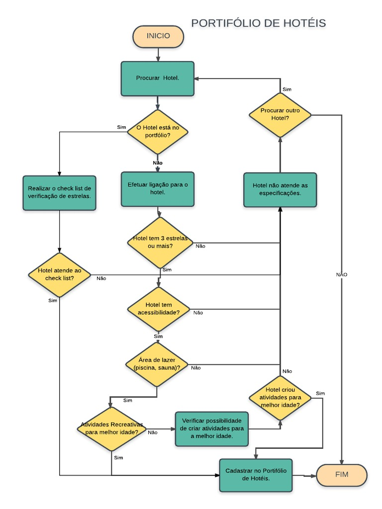

```
Título: LABORATÓRIO PYTHON - PRÁTICA 2
Autor: MAURILIO CARDOSO GONÇALVES
Data: 28/07/21
Sistema Operacional: Unix Like
```
# LABORATÓRIO PYTHON - PORTIFÓLIO DE HOTÉIS
## PRÉ-REQUISITOS
* PYTHON 3 OU SUPERIOR

## EXECUÇÃO DO PROGRAMA
* EXECUTAR O ARQUIVO main.py
  
## MODELO CLIENTE


## MAPA MENTAL


